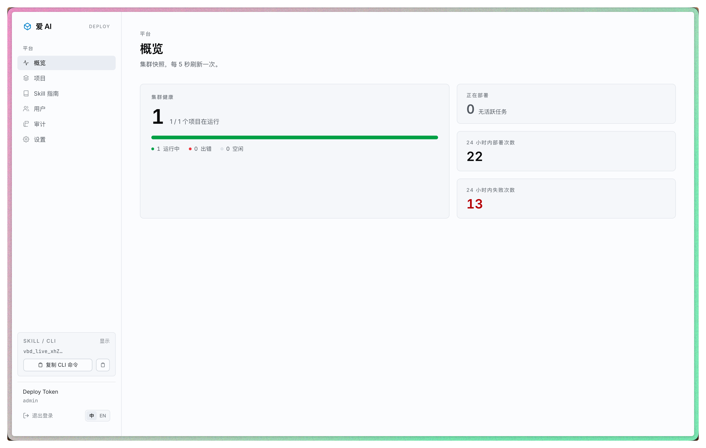
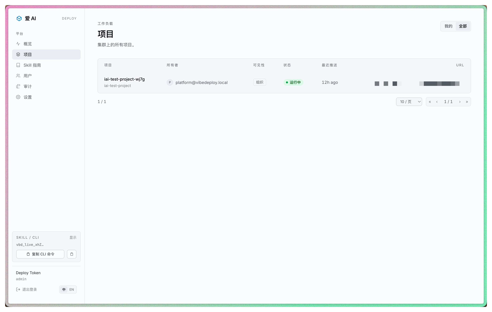
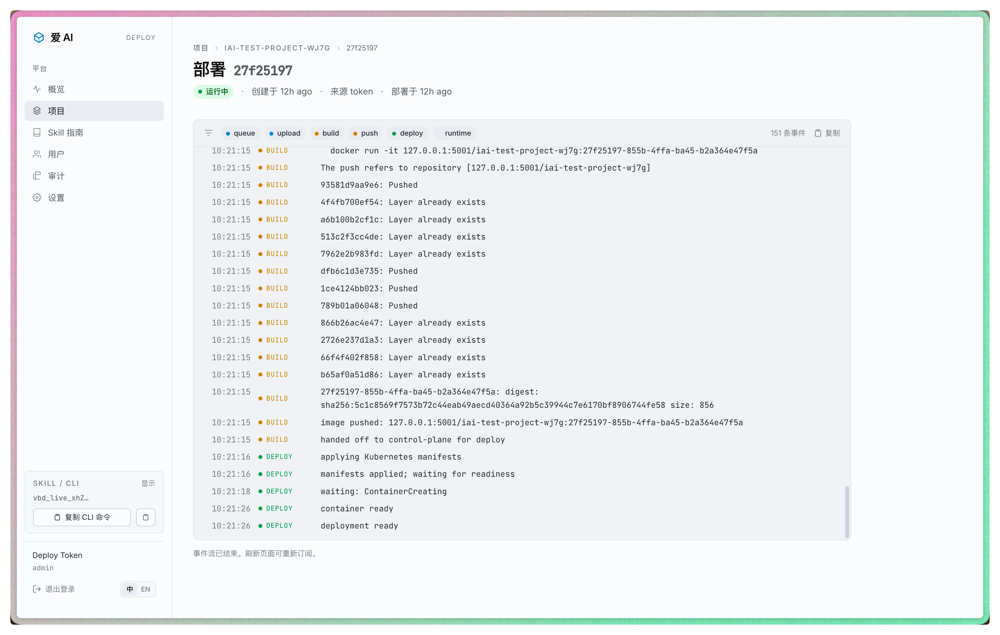
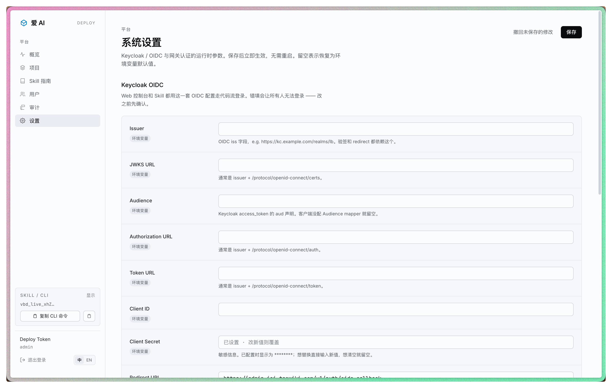
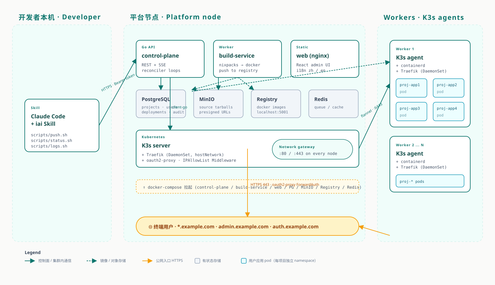
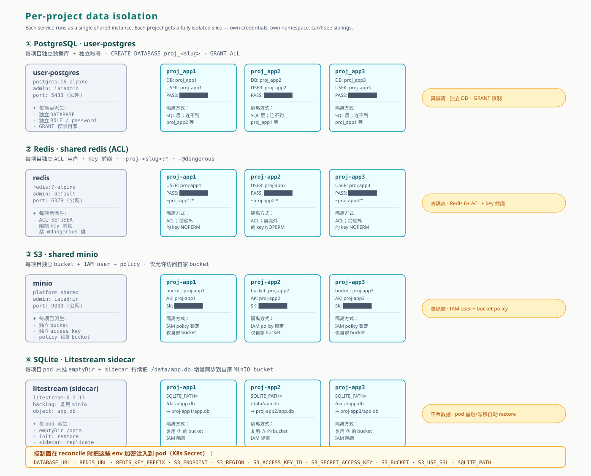

<div align="center">


# 爱 AI · iai

**面向公司内部的一键部署平台**

跟 Claude 说一句「部署一下」，1-3 分钟拿到带 SSO + HTTPS 的可访问 URL。<br/>
不写 Dockerfile，不碰 K8s，不配 DNS。

[简体中文](README.md) · [English](README.en.md)

<br/>


<br/>


</div>

---

## ✨ 它能干什么

```bash
cd <project>          # 任意项目目录
claude                # 在 Claude Code 里说一句话
> 部署一下
                      # 1-3 分钟后:
                      # 🚀 https://my-app.example.com
```

把内部小工具 / Demo / AI Agent 从「只能在自己电脑跑」变成「同事可以打开的网址」，自带：

- 🔐 **企业 SSO** — 通过 Keycloak / OIDC 接公司账号体系，外人打不开
- 🌐 **HTTPS + 通配证书** — 自带 TLS，自动 80→443 跳转
- 🎯 **IP 白名单** — 全局命名预设（管理员维护）+ 项目自定义
- 🪪 **自定义子域** — `my-app.example.com` 而不是随机字符
- 🗄️ **自动开通数据库** — manifest 写 `postgres = true`，平台自动建库 + 注入 `DATABASE_URL`，业务无需申请
- 🪶 **SQLite 不丢数据** — Litestream sidecar 把 `/data/app.db` 实时同步到 S3；pod 重启 / 节点漂移自动从 S3 恢复
- 🔑 **加密环境变量** — Web 后台改密钥（KEK 加密落 DB），部署时自动注入到 pod，源码里不留明文
- 🤝 **协作者管理** — 邀请同事共同维护
- 📊 **实时日志** — SSE 流，构建过程一行一行打出来
- 🔁 **健康自愈** — pod 挂了自动恢复，DB 状态自动校准

---

## 📚 文档

| 给谁看 | 看哪份 |
| :--- | :--- |
| 业务同学 / 第一次用 | [📖 使用手册](docs/使用手册.md) — 通俗版，15 分钟读完 |
| 工程师 / 想了解原理 | [🏗️ 技术架构](docs/技术架构.md) — 架构、链路、设计决策 |
| SRE / 备份 / 扩容 | [🔧 运维手册](docs/运维手册.md) — 备份、PG/MinIO/Registry 外置、平台节点 HA |
| 运维 / 想自己部署一套 | [下方 ECS 部署一节](#-部署到-ecs) |
| 开发者 / 想改这套平台 | [下方本地开发一节](#-本地开发) |

---

## 🚀 一键部署（开发者本机）

复制下面这条，整行粘到终端：

```bash
rm -rf ~/iai && git clone https://github.com/almightyYantao/it-iai.git ~/iai && bash ~/iai/skill/install.sh install
```

幂等——升级时同一条再粘一次。

详细使用：见 [使用手册](docs/使用手册.md)。

---

## 📸 长这样

<table>
<tr>
<td width="50%">

<p align="center"><sub>概览页：集群健康一眼看清</sub></p>
</td>
<td width="50%">

<p align="center"><sub>项目详情：pod 状态、访问控制、协作者</sub></p>
</td>
</tr>
<tr>
<td width="50%">

<p align="center"><sub>部署详情：实时构建日志</sub></p>
</td>
<td width="50%">

<p align="center"><sub>设置：Keycloak / 访问预设热加载</sub></p>
</td>
</tr>
</table>

---

## 🏗️ 整体架构



```
 开发者本机           平台节点                              Worker 节点

 ┌──────────┐        ┌──────────┐  ┌──────────┐
 │ Claude   │ ─API─▶ │ control- │──┤   PG     │           ┌────────────┐
 │ Code +   │        │ plane    │  │  MinIO   │           │ K3s agent  │
 │ Skill    │        ├──────────┤  │ Registry │           │            │
 └──────────┘        │ build-   │  │  Redis   │           │ user pods  │
                     │ service  │  │ user-PG  │ ← 自动开  │ (proj-xxx) │
                     └──────────┘  └──────────┘   给项目  └────────────┘
                          │                                       ▲
                          │       K3s server + Traefik            │
                          │       (DaemonSet, hostNetwork)        │
                          └──────────►─────────────────────────────┘
                                          ↑
                                          │  HTTPS 443
                          ┌───────────────┴────────────────┐
                          │ *.example.com   用户应用    │
                          │ admin.example.com  管理后台 │
                          │ auth.example.com   SSO     │
                          └────────────────────────────────┘
```

完整链路、组件之间的协议、设计决策（为什么用 K3s 不用 EKS / 为什么 SSE 不用 WebSocket / 为什么每项目一个 namespace），看 [技术架构](docs/技术架构.md)。

---

## 🗄️ 数据隔离 & 自动开通

manifest 里声明 `postgres = true` / `redis = true` / `s3 = true`，平台部署时自动开通对应资源、把连接串加密注入到 pod。业务方不用申请、不用配 DNS、不用想密码——但每个项目拿到的都是**真隔离**的切片，不是共享凭据。



| 服务 | 共享底座 | 每项目派生 | 隔离方式 |
| :--- | :--- | :--- | :--- |
| **PostgreSQL** | `user-postgres` 容器（独立 PG，跟控制面 DB 分开） | 独立 database `proj_<slug>` + 独立 role + 随机密码 | SQL 层：`GRANT` 只到自家 DB，跨项目 `\c` 都不行 |
| **Redis** | 共享 `redis` 容器（Redis 6 ACL） | ACL 用户 `proj-<slug>` + 限制 key 前缀 `~proj-<slug>:*` + 禁 `@dangerous` | ACL 层：写非前缀 key 直接 `NOPERM` |
| **MinIO / S3** | 共享 `minio` 容器（复用平台底座） | 独立 bucket `proj-<slug>` + 独立 IAM 用户 + bucket-only policy | IAM 层：policy 锁死，列别人 bucket 直接 403 |
| **SQLite** | 共享 MinIO 做 Litestream 复制目标（无单独底座） | pod 内 emptyDir `/data` + Litestream sidecar + init 容器从 S3 恢复 | 每项目自家 bucket 存 WAL；天然隔离（沿用 S3 的 IAM 隔离） |

注入到 pod 的环境变量：

```bash
DATABASE_URL             # postgres://proj_<slug>:****@<host>:5433/proj_<slug>
REDIS_URL                # redis://proj-<slug>:****@<host>:6379/0
REDIS_KEY_PREFIX         # proj-<slug>:
S3_ENDPOINT              # <host>:9000
S3_REGION                # us-east-1
S3_ACCESS_KEY_ID         # proj-<slug>
S3_SECRET_ACCESS_KEY     # ****
S3_BUCKET                # proj-<slug>
S3_USE_SSL               # false
SQLITE_PATH              # /data/app.db    (仅当 needs.sqlite=true)
```

值在数据库里用 KEK 加密落地，部署时解密注入到 K8s Secret，pod 里读 `os.environ["DATABASE_URL"]` 就能用。

项目删除时：PG 数据库 + Redis ACL 用户 + S3 user/policy **自动撤销**；S3 bucket 保留（防止误删丢数据，admin 确认后手工 `mc rb --force` 清理）。

---

## 🛠️ 部署到 ECS

3 步：装平台节点 → 装 worker → 配 TLS + SSO。每个脚本都幂等，重复跑安全。

### 1. 平台节点

```bash
git clone https://github.com/almightyYantao/it-iai.git /opt/it-iai
cd /opt/it-iai

sudo BASE_DOMAIN=example.com \
     deploy/install-platform.sh
```

这步装好：Docker + K3s server + docker-compose 全家桶（PG / MinIO / Registry / Redis / control-plane / build-service / web nginx），并打印 **bootstrap Deploy Token** 和 **worker 加入命令**。

### 2. Worker 节点（每台跑一次）

用平台节点输出的命令：

```bash
sudo K3S_URL=https://<platform-ip>:6443 \
     K3S_TOKEN=<token>                  \
     PLATFORM_IP=<platform-ip>          \
     REGISTRY_PULL_HOST=<platform-ip>:5001 \
     deploy/install-worker.sh
```

健康检查：

```bash
sudo /opt/it-iai/deploy/check-k3s.sh    # 平台
sudo bash deploy/check-agent.sh         # 每台 worker
```

### 3. SSO + TLS

在 Web 设置页填好 Keycloak OIDC 配置 → 保存（热生效，无需重启）。然后：

```bash
# 通配证书放到 /opt/it-iai/tls/，文件名 *.crt + *.key
sudo /opt/it-iai/deploy/install-tls.sh

# 安装 oauth2-proxy + Traefik ForwardAuth 中间件
sudo /opt/it-iai/deploy/install-oauth2-proxy.sh

# 把管理后台搬到 admin.<base-domain>
sudo /opt/it-iai/deploy/install-admin-ui-tls.sh
```

DNS：把 `*.<BASE_DOMAIN>` 和 `auth.<BASE_DOMAIN>`、`admin.<BASE_DOMAIN>` 都指向平台节点 IP。

### 升级

```bash
cd /opt/it-iai
sudo git pull

# --build 让所有有 build context 的服务（control-plane / build-service / web）
# 一并重建。只重建 control-plane 会漏掉 build-service / 前端的更新。
sudo docker compose up -d --build
```

控制面启动时自动跑新 migration。pod 在 worker 上不受影响。

### 网络端口

<details>
<summary>展开查看</summary>

平台 ↔ worker（**私有子网内**）：

| 端口 | 协议 | 用途 |
| :--- | :--- | :--- |
| 6443  | tcp | K3s API |
| 10250 | tcp | kubelet |
| 8472  | udp | flannel VXLAN |
| 5001  | tcp | image registry（workers 拉镜像用） |

对外（**仅平台节点**）：

| 端口 | 协议 | 用途 |
| :--- | :--- | :--- |
| 80  | tcp | Traefik HTTP（自动 302 跳 443） |
| 443 | tcp | Traefik HTTPS（通配证） |

</details>

### 卸载

```bash
sudo deploy/uninstall.sh
```

---

## 🔧 备份与扩容

跑通之后第二件最重要的事。按 **收益/工作量** 从高到低三步：

### 1. 备份（**必做**）

最少做这件事：每天 `pg_dump` + `.env` + `tls/` 异地存一份。一个 cron 脚本搞定，详细脚本在 [运维手册 §1](docs/运维手册.md#1-%E5%A4%87%E4%BB%BD)。

⚠️ `.env` 里的 `CP_KEK_BASE64` 是 DB 里加密字段（token / secret）的根密钥，**丢了所有 Deploy Token 就解不开**——必须单独存一份到密码管理器或加密保险库。

### 2. 把 state 外置（**强烈推荐**）

平台节点磁盘满 / 想做 HA 之前，先把这三个外置：

| 组件 | 推荐换成 | 改动 |
|---|---|---|
| Postgres | 阿里云 RDS PostgreSQL 或独立 ECS | 改 `.env` 里 `CP_DATABASE_URL` |
| MinIO | 阿里云 OSS（S3 兼容） | 改 `CP_S3_*` 一组 |
| Registry | 阿里云 ACR | 改 `CP_REGISTRY_HOST*` + worker 的 `registries.yaml` |

每个组件之间本来就是网络通信，外置只是改 env，**不需要重写代码**。详细迁移步骤 + 验证清单：[运维手册 §2-§4](docs/运维手册.md#2-pg-%E5%A4%96%E7%BD%AE%E6%90%AC%E5%88%B0-rds--%E7%8B%AC%E7%AB%8B-ecs)。

做完之后平台节点变**无状态**——磁盘炸了重装一台 ECS、`git pull` + `docker compose up -d --build` + 把 `.env` / `tls/` 拷回来，就完全恢复。

### 3. 多平台节点 + HA（可选）

外置 state 之后才能做。两台或三台平台节点接入 SLB，K3s server 升级到 3-node etcd 集群。详细：[运维手册 §5](docs/运维手册.md#5-%E5%A4%9A%E5%B9%B3%E5%8F%B0%E8%8A%82%E7%82%B9--ha)。

> 单平台节点能撑到团队 ~20 人 / ~50 个项目。在那之前先把 §1 §2 做扎实，不用急着上 HA。

---

## 💻 本地开发

跑 Go / TS 改动用，本机起 k3d 集群 + docker-compose：

```bash
make dev
```

跑完后：

| URL | 是什么 |
| :--- | :--- |
| `http://localhost:5173` | Web 管理后台 |
| `http://localhost:8080` | Control Plane REST API |
| `http://localhost:9001` | MinIO 控制台 |
| `http://localhost:5001` | 本地 image registry |

推一个示例 app：

```bash
export VIBEDEPLOY_TOKEN=<token>
export VIBEDEPLOY_API=http://localhost:8080

cd examples/hello-node
bash ../../skill/scripts/push.sh
```

清理：`make destroy`

---

## 📂 仓库布局

```
.
├── cmd/control-plane/       Go 主程序
├── cmd/build-service/       构建工作者
├── internal/
│   ├── api/                 HTTP handlers + middleware
│   ├── auth/                JWT + KEK + Deploy Token
│   ├── config/              env + runtime 配置（热加载）
│   ├── k8sdriver/           client-go 包装 + Traefik Middleware CR
│   ├── model/               领域类型
│   └── store/               pgxpool + 各表 CRUD
├── migrations/              0001-0005 顺序 SQL
├── deploy/                  ECS 多节点安装 + 巡检脚本
├── skill/                   Claude Code Skill
├── web/                     Vite + React + Tailwind 管理后台
├── docs/
│   ├── 技术架构.md          工程师向
│   ├── 使用手册.md          业务向
│   └── images/              README 用的截图素材（待填充）
├── examples/                端到端冒烟样例
└── docker-compose.yml       平台节点服务栈
```

---

## 🤝 贡献

提 PR / commit message 风格：`feat(scope): ...` / `fix(scope): ...` / `docs: ...`，看 `git log --oneline` 找现成模板。

代码改动 → 先 `go build ./...` + `cd web && npx tsc --noEmit` 都过再 push。

---

## ⭐ Star History

<a href="https://star-history.com/#almightyYantao/it-iai&Date">
  <picture>
    <source media="(prefers-color-scheme: dark)" srcset="https://api.star-history.com/svg?repos=almightyYantao/it-iai&type=Date&theme=dark" />
    <source media="(prefers-color-scheme: light)" srcset="https://api.star-history.com/svg?repos=almightyYantao/it-iai&type=Date" />
    
  </picture>
</a>
